 
 

  
    
  

  

Me chamo Giovanni, tenho 19 anos e sou descendente de italianos, com dupla cidadania. Estudo Engenharia de Computação na Unaerp, atualmente no terceiro semestre. Desde criança sou apaixonado por tecnologia, tendo iniciado com cursos de robótica e programação em Scratch. Hoje, possuo uma base sólida em C, SQL e Desenvolvimento Web, tendo concluído recentemente o curso Mimo Max (13 certificados). Atualmente, estou desenvolvendo um projeto com React, Electron e SQLite, além de ter realizado um minicurso em automação com n8n. Sou fluente em inglês e tenho noções de italiano e espanhol. Busco oportunidades de estágio para aplicar meus conhecimentos em projetos inovadores e contribuir com soluções de impacto.

## Linguagens e Tecnologias

  

  

  

  

  
    
  
  
  
  
  

  
  
  
  
  

## Estatísticas

  
  &nbsp;&nbsp;
  

  <picture>
    <source media="(prefers-color-scheme: dark)" srcset="https://raw.githubusercontent.com/GiovanniJorge/GiovanniJorge/output/github-snake-dark.svg">
    <source media="(prefers-color-scheme: light)" srcset="https://raw.githubusercontent.com/GiovanniJorge/GiovanniJorge/output/github-snake.svg">
    
  </picture>

